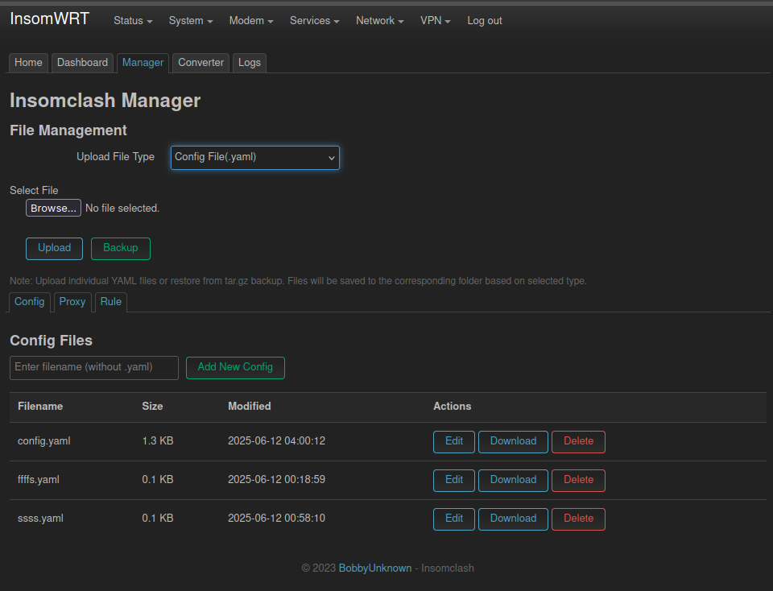

# Insomclash

[🇮🇩 Indonesia](README.md)

[](https://github.com/bobbyunknown/insomclash)
[](https://github.com/bobbyunknown/insomclash/releases)

#### Support me:
[](https://sociabuzz.com/bobbyunknown/tribe)
[](https://saweria.co/widgets/qr?streamKey=48ea6792454c7732924b663381c69521)


#### Telegram group:
[](https://t.me/+TuLCASzJrVJmNzM1)

**Insomclash** is a lightweight yet powerful controller and manager for the **Mihomo** (Clash Meta) core, designed specifically for **OpenWrt** and **Linux Server** (such as Debian/Ubuntu/Arch Linux) systems. This application facilitates easy proxy connection management with advanced routing capabilities and a modern web interface.

This repository serves as the **official build and packaging center** for Insomclash, supporting OpenWrt (IPK/APK), Debian/Ubuntu (DEB), and Arch Linux (PKG).

## 🌟 Key Features

*   **Core Management**: A specialized wrapper for the Mihomo binary aimed at efficiently handling the application lifecycle (start/stop/restart), configuration management, and log monitoring.
*   **Advanced Routing Modes**:
    *   **TUN Mode**: Supports full Layer 3 tunneling with automatic route management.
    *   **TProxy Mode**: Transparent Proxy support for comprehensive network traffic handling.
    *   **Redirect Mode**: Basic support for traffic redirection.
*   **Deep OpenWrt Integration**:
    *   **Firewall 4 (fw4) Support**: Automatically detects and integrates with OpenWrt's modern `fw4` (nftables) system for reliable traffic interception.
    *   **LuCI App**: Native integration with the OpenWrt web interface (`luci-app-insomclash`), allowing direct configuration from your router's GUI.
*   **Modern Web Dashboard**:
    *   **React-based Dashboard**: Responsive and modern interface.
    *   **Full Core Control**: Start/Stop/Restart the Mihomo service directly from the web.
    *   **File Manager & Editor**: Edit configuration files (`config.yaml`), proxy providers, and rule providers without needing SSH.
    *   **Backup & Restore**: Easy-to-use Insomclash configuration backup feature.
    *   **Subscription Converter**: Built-in tool for converting proxy subscription formats.
    *   **Log & Monitoring**: View core logs in real-time via WebSocket.
    *   **DNS Management**: Easily configure DNS settings.

<details>
<summary><b>📸 Screenshots (Click to view)</b></summary>
<br>

| **Dashboard** | **Tools** |
| :---: | :---: |
|  |  |

| **File Manager** | **Log Monitor** |
| :---: | :---: |
|  |  |

<p align="center">
  <b>Overview</b><br>
  
</p>

</details>
*   **Multi-Architecture Support**:
    *   **x86**: `x86_64` (AMD64)
    *   **ARM**: `aarch64` (ARM64), `armv7` (ARMHF)
    *   **MIPS**: `mips_24kc`, `mipsel_74kc` (OpenWrt Targets)
*   **Auto-Update**: Automatic asset management (GeoIP, GeoSite, UI).

## 📦 Installation

### OpenWrt

Supported versions: **STABLE IPK** and **SNAPSHOT APK**.

1.  **Download** the latest release from the [Releases](https://github.com/bobbyunknown/Insomclash/releases) page.
2.  Extract the archive and locate the folder corresponding to your router's architecture (e.g., `aarch64_cortex-a53`).
3.  Upload the `.ipk` files to your router (e.g., using `scp` or WinSCP).
4.  Install the packages:
    ```bash
    # Update package list first
    opkg update

    # Install core and LuCI app
    opkg install insomclash_*.ipk luci-app-insomclash_*.ipk
    ```
5.  Access the interface via **LuCI -> Services -> Insomclash** or the standalone dashboard at `http://router-ip:9090/ui`.

### Debian / Ubuntu (Linux Server)

Supported architectures: **amd64**, **arm64**, **armhf**.

1.  **Download** the `.deb` package from the [Releases](https://github.com/bobbyunknown/Insomclash/releases) page.
2.  Install using `dpkg`:
    ```bash
    sudo dpkg -i insomclash_*.deb
    
    # If there are missing dependencies:
    sudo apt-get install -f
    ```
3.  The service will start automatically. You can manage it via systemd:
    ```bash
    sudo systemctl status insomclash
    sudo systemctl restart insomclash
    ```
4.  Configuration files are located in `/etc/insomclash/`.

### Arch Linux

Supported architectures: **x86_64**, **aarch64**, **armv7h**.

1.  **Download** the `.pkg.tar.zst` package from the [Releases](https://github.com/bobbyunknown/Insomclash/releases) page.
2.  Install using `pacman`:
    ```bash
    sudo pacman -U insomclash-*.pkg.tar.zst
    ```
3.  The service will start automatically. You can manage it via systemd:
    ```bash
    sudo systemctl status insomclash
    sudo systemctl restart insomclash
    ```
4.  Configuration files are located in `/etc/insomclash/`.

## 🛠️ Build from Source

This repository contains the build capability and packaging logic.

### Prerequisites
*   Linux Environment (Ubuntu 22.04+ recommended)
*   `make`, `curl`, `wget`, `git`

### Build All Packages
To build everything (OpenWrt Packages + Debian Packages + Arch Linux Packages) locally:

```bash
# Clone this repo
git clone https://github.com/bobbyunknown/Insomclash.git
cd Insomclash

# Run build
make build-all
```

Build results (Artifacts) will be stored in the `build/` folder (for Debian and Arch Linux) and `bin/` (for OpenWrt).

## 📄 License

This project is licensed under the **MIT License**.
