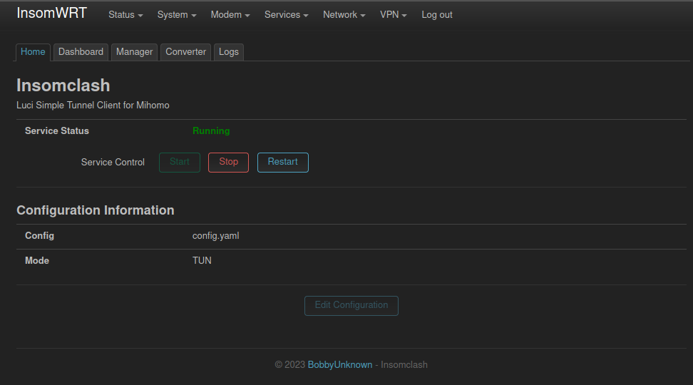
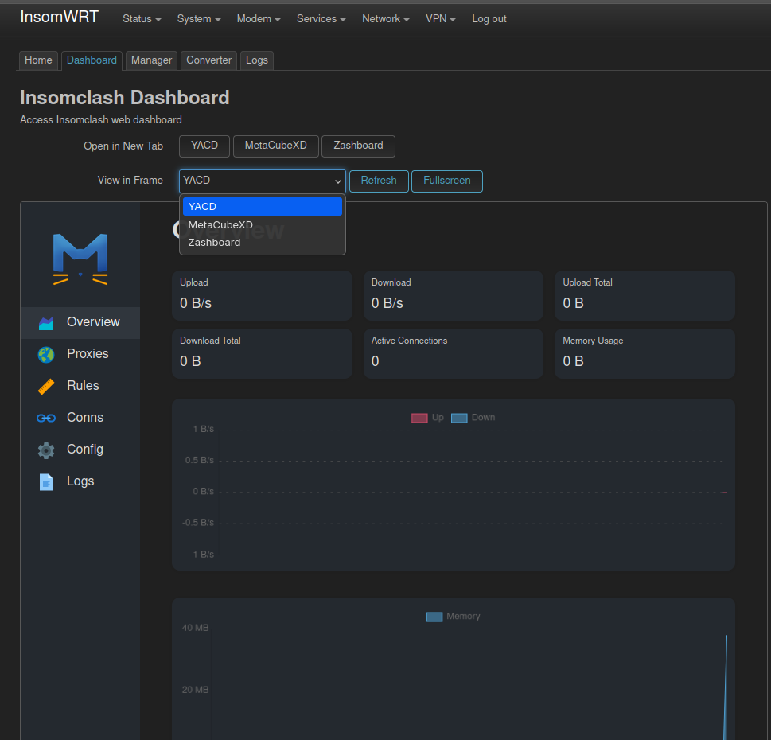
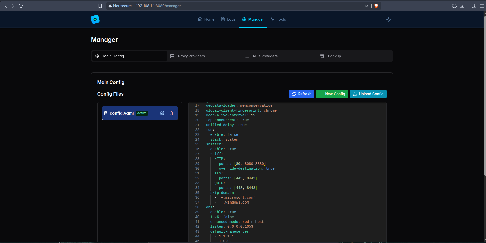
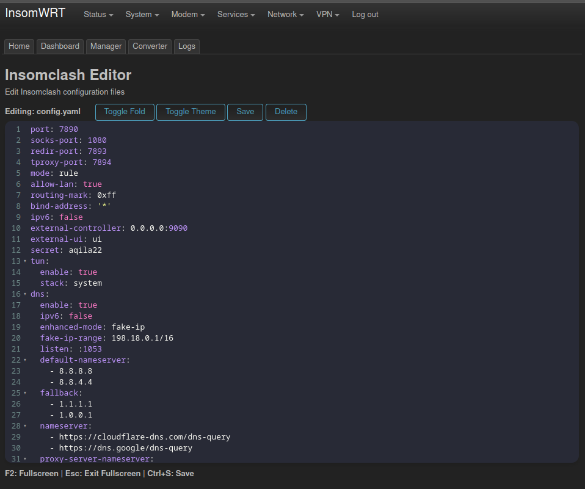
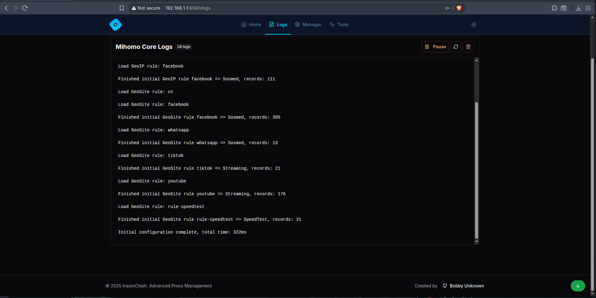

## Luci app insomclash

[](https://github.com/bobbyunknown)
[](https://github.com/bobbyunknown/luci-app-insomclash/releases)

#### Support me:
[](https://sociabuzz.com/bobbyunknown/tribe)
[](https://saweria.co/widgets/qr?streamKey=48ea6792454c7732924b663381c69521)


#### Telegram group:
[](https://t.me/+TuLCASzJrVJmNzM1)


### Features
- Support mihomo
- TUN & TPROXY
- Dashboard, Yacd Zashboard Metacubexd
- Manager, Backup restore & Editor
- Converter trojan, vmess, vless, Support subscribe converter

### Installation

#### Manual Method
- Download the installation package from [Release](https://github.com/bobbyunknown/luci-app-insomclash/releases)
#### Auto Install Method
- Run the following command in the terminal:
```bash
bash -c "$(curl -fsSL https://raw.githubusercontent.com/bobbyunknown/luci-app-insomclash/main/install.sh)"
```

### Screenshot

<details>
<summary>Home</summary>


</details>

<details>
<summary>Dashboard</summary>


</details>

<details>
<summary>Manager</summary>


</details>

<details>
<summary>Editor</summary>


</details>

<details>
<summary>Logs</summary>


</details>

### Credit
Terima kasih kepada:
- Allah SWT
- DBAI
- IndoWRT
- [MetaCubeX](https://github.com/MetaCubeX) Mihomo


