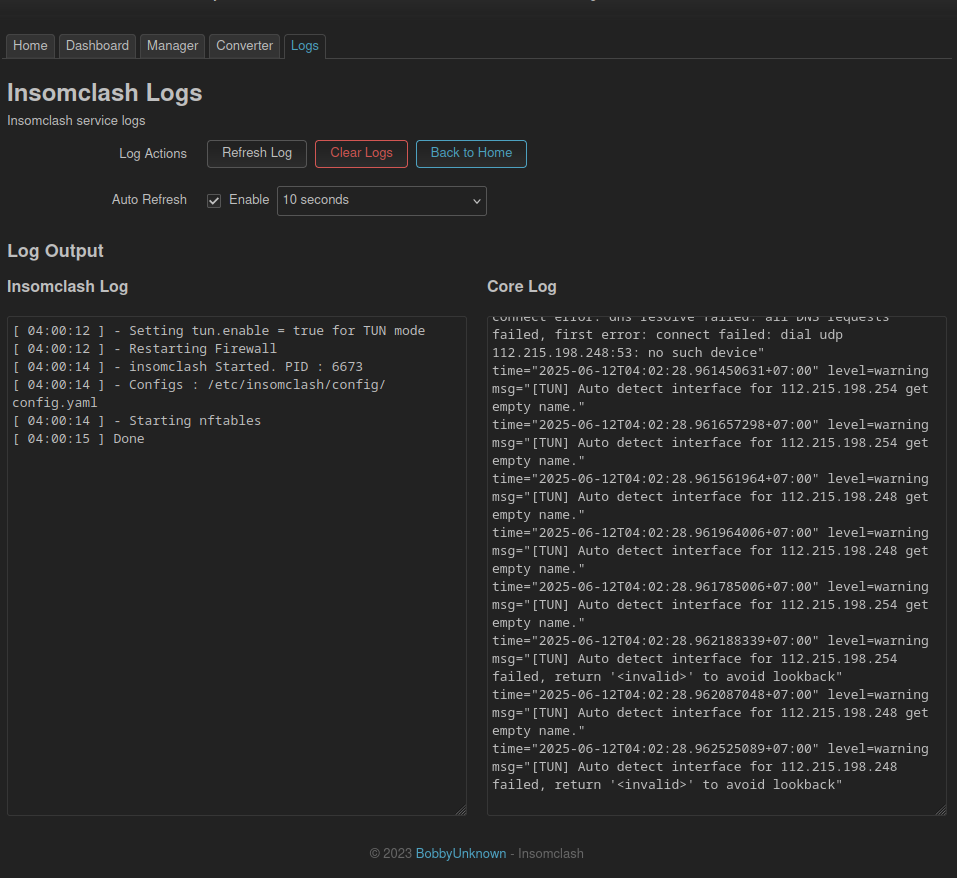

# Insomclash

[🇺🇸 English](README-EN.md)

[](https://github.com/bobbyunknown/insomclash)
[](https://github.com/bobbyunknown/insomclash/releases)

#### Support me:
[](https://sociabuzz.com/bobbyunknown/tribe)
[](https://saweria.co/widgets/qr?streamKey=48ea6792454c7732924b663381c69521)


#### Telegram group:
[](https://t.me/+TuLCASzJrVJmNzM1)

**Insomclash** adalah controller dan manager yang ringan namun powerful untuk core **Mihomo** (Clash Meta), dirancang khusus untuk sistem **OpenWrt** dan **Linux Server** (seperti Debian/Ubuntu/Arch Linux). Aplikasi ini memudahkan Anda dalam mengelola koneksi proxy dengan kemampuan routing tingkat lanjut serta antarmuka web modern.

Repository ini berfungsi sebagai **pusat build dan packaging resmi** untuk Insomclash, mendukung OpenWrt (IPK/APK), Debian/Ubuntu (DEB), dan Arch Linux (PKG).

## 🌟 Fitur Utama

*   **Manajemen Core**: Wrapper khusus untuk binary Mihomo yang menangani siklus hidup aplikasi (start/stop/restart), manajemen konfigurasi, dan monitoring log secara efisien.
*   **Mode Routing Canggih**:
    *   **TUN Mode**: Mendukung tunneling Layer 3 penuh dengan manajemen rute otomatis.
    *   **TProxy Mode**: Dukungan Transparent Proxy untuk penanganan trafik jaringan yang menyeluruh.
    *   **Redirect Mode**: Dukungan dasar untuk pengalihan trafik (traffic redirection).
*   **Integrasi Mendalam dengan OpenWrt**:
    *   **Dukungan Firewall 4 (fw4)**: Secara otomatis mendeteksi dan berintegrasi dengan sistem `fw4` (nftables) modern milik OpenWrt untuk intersepsi trafik yang handal.
    *   **Aplikasi LuCI**: Integrasi native dengan antarmuka web OpenWrt (`luci-app-insomclash`), memungkinkan konfigurasi langsung dari GUI router Anda.
*   **Dashboard Web Modern**:
    *   **Dashboard berbasis React**: Antarmuka responsif dan modern.
    *   **Kontrol Penuh Core**: Start/Stop/Restart service Mihomo langsung dari web.
    *   **File Manager & Editor**: Edit file konfigurasi (`config.yaml`), proxy provider, dan rule provider tanpa perlu SSH.
    *   **Backup & Restore**: Fitur backup konfigurasi Insomclash yang mudah digunakan.
    *   **Subscription Converter**: Tool bawaan untuk mengubah format langganan proxy.
    *   **Log & Monitoring**: Lihat log core secara real-time lewat WebSocket.
    *   **DNS Management**: Konfigurasi pengaturan DNS dengan mudah.

<details>
<summary><b>📸 Screenshot (Klik untuk melihat)</b></summary>
<br>

| **Dashboard** | **Tools** |
| :---: | :---: |
|  |  |

| **File Manager** | **Log Monitor** |
| :---: | :---: |
|  |  |

<p align="center">
  <b>Overview</b><br>
  
</p>

</details>
*   **Dukungan Multi-Arsitektur**:
    *   **x86**: `x86_64` (AMD64)
    *   **ARM**: `aarch64` (ARM64), `armv7` (ARMHF)
    *   **MIPS**: `mips_24kc`, `mipsel_74kc` (Target OpenWrt)
*   **Auto-Update**: Manajemen aset otomatis (GeoIP, GeoSite, UI).

## 📦 Instalasi

### OpenWrt

Versi yang didukung: **STABLE IPK** dan **SNAPSHOT APK**.

1.  **Download** rilis terbaru dari halaman [Releases](https://github.com/bobbyunknown/Insomclash/releases).
2.  Ekstrak arsip tersebut dan cari folder yang sesuai dengan arsitektur router Anda (contoh: `aarch64_cortex-a53`).
3.  Upload file `.ipk` ke router Anda (bisa menggunakan `scp` atau WinSCP).
4.  Install paketnya:
    ```bash
    # Update daftar paket terlebih dahulu
    opkg update

    # Install core dan aplikasi LuCI
    opkg install insomclash_*.ipk luci-app-insomclash_*.ipk
    ```
5.  Akses antarmuka melalui **LuCI -> Services -> Insomclash** atau dashboard mandiri di `http://ip-router:9090/ui`.

### Debian / Ubuntu (Linux Server)

Arsitektur yang didukung: **amd64**, **arm64**, **armhf**.

1.  **Download** paket `.deb` dari halaman [Releases](https://github.com/bobbyunknown/Insomclash/releases).
2.  Install menggunakan `dpkg`:
    ```bash
    sudo dpkg -i insomclash_*.deb
    
    # Jika ada error dependency yang kurang:
    sudo apt-get install -f
    ```
3.  Layanan akan berjalan otomatis. Anda bisa mengelolanya via systemd:
    ```bash
    sudo systemctl status insomclash
    sudo systemctl restart insomclash
    ```
4.  File konfigurasi terletak di `/etc/insomclash/`.

### Arch Linux

Arsitektur yang didukung: **x86_64**, **aarch64**, **armv7h**.

1.  **Download** paket `.pkg.tar.zst` dari halaman [Releases](https://github.com/bobbyunknown/Insomclash/releases).
2.  Install menggunakan `pacman`:
    ```bash
    sudo pacman -U insomclash-*.pkg.tar.zst
    ```
3.  Layanan akan berjalan otomatis. Anda bisa mengelolanya via systemd:
    ```bash
    sudo systemctl status insomclash
    sudo systemctl restart insomclash
    ```
4.  File konfigurasi terletak di `/etc/insomclash/`.

## 🛠️ Build dari Source

Repository ini berisi logika build dan packaging.

### Prasyarat
*   Lingkungan Linux (Direkomendasikan Ubuntu 22.04+)
*   `make`, `curl`, `wget`, `git`

### Build Semua Paket
Untuk mem-build semuanya (Paket OpenWrt + Paket Debian + Paket Arch Linux) secara lokal:

```bash
# Clone repo ini
git clone https://github.com/bobbyunknown/Insomclash.git
cd Insomclash

# Jalankan build
make build-all
```

Hasil build (Artifact) akan tersimpan di folder `build/` (untuk Debian dan Arch Linux) dan `bin/` (untuk OpenWrt).

## 📄 Lisensi

Proyek ini dilisensikan di bawah **MIT License**.
