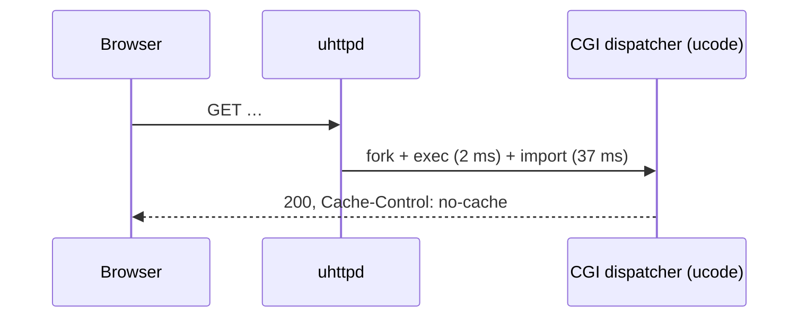
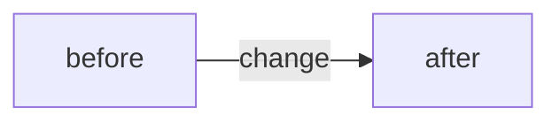

# <Title: one line, the change, not the complaint>

**Status:** draft · **Decision:** pending | submitted <PR link> | interim in Aurora | dropped <why> · **Target:** openwrt/luci `<branch>` | uhttpd | rpcd | eamonxg feed · **Date:** <YYYY-MM-DD>

## Problem

Two or three sentences: what happens today, on which request, with the
measured cost (from `dispatch-cost.md` or a named bench run). One sentence on
who pays (every navigation / every session / every install).

## Evidence

| # | fact | where |
|---|---|---|
| 1 | … | `openwrt/luci@<branch> modules/luci-base/ucode/http.uc:499` |
| 2 | … | `uhttpd file.c:344` |

Unknowns (not yet verified) listed here, each with the command that settles it.

## Today

Label edges with cost (ms, bytes, RTT). One diagram per mechanism.

## Proposal

Change sketch: exact file and function, approximate size in lines, the new
headers/config/API. Behaviour on 23.05 / 24.10 / 25.12 / master. What stays
byte-identical for users who do not opt in.

## Alternatives considered

Each in one line with why it loses (measured or structural).

## Measurement plan

Before/after commands (`bench-dispatch.sh`, `bench.mjs`, `bench-fullload.mjs`),
the numbers expected to move, the device class. "not measured yet" is a
valid entry; an invented number is not.

## Interim in Aurora

What this theme (or the eamonxg feed) can do without upstream, and what it
cannot; link the `/luci-change` plan if one exists.

## Submission

Repository and branch, commit granularity (one logical change), cover-letter
contents: problem, measurement before/after with device, compatibility
statement, test performed.
