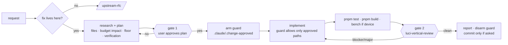
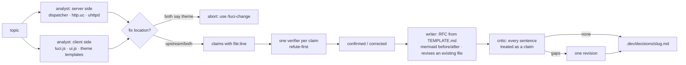

# Agent workflows

Two commands, one knowledge skill, five vertical agents, one mechanical
guard. Everything an agent asserts about luci-base or uhttpd must come from
a source checkout (`$LUCI_SRC`, `$UHTTPD_SRC` in the git-ignored `.dev/.env`)
and be cited as `file:line`; the facts they start from live in
`.claude/skills/luci-knowledge/`.

| Command | Use when | Output |
|---|---|---|
| `/luci-change <request>` | anything that edits `.dev/src`, `ucode/`, `htdocs/`, `root/`, `Makefile`, `vite.config.ts`, CI | a reviewed change in the working tree; commit only on request |
| `/upstream-rfc "<topic>"` | the fix belongs in luci-base / uhttpd / rpcd / the feed | `.dev/decisions/<slug>.md` with diagrams; no code change here |
| `/luci-vertical-review [base]` | step 6 of `/luci-change`, or any branch | ranked, verified findings |

## Changing this repository

Gate 1 is plan mode: `ExitPlanMode` needs the user's selection; nothing is
edited before it. Gate 2 is the `luci-vertical-review` workflow:
`aurora-static-reviewer` (templates, CSS, tokens, patches, packaging, CI)
and `aurora-runtime-reviewer` (menu/router JS, teardown, polling, a11y)
review in parallel; every finding then goes to `luci-claim-verifier`, which
tries to refute it against the sources before it can be reported. With a
scope file the reviewers also check that the diff stayed inside the approved
paths.

The guard is `.claude/hooks/guard-edits.sh` (PreToolUse on
`Edit|Write|MultiEdit`): edits to shipped/source paths are refused unless
`.claude/.change-approved` lists a matching prefix. Docs, tests and `.claude/`
are not guarded. Edits made through Bash (`sed -i`, heredocs) are not seen
by the hook — the review's scope check is the second net. To bypass
deliberately, create the marker yourself; to disable, remove the hook from
`.claude/settings.json`.

## Proposing an upstream change

Refuted claims never reach the document; unknowns are listed, not filled.
The writer may write only under `.dev/decisions/`. Bounds: at most 12
claims are verified (the rest are logged as dropped), one revision pass.

## Decision records (`.dev/decisions/`, local)

Proposals from `/upstream-rfc` and the closing report of every
`/luci-change` land in `.dev/decisions/`. The directory is git-ignored
except `TEMPLATE.md`: these files are drafts of one maintainer's decision
process — device numbers, half-verified claims, revisions — not
documentation. The durable record lives where the decision is acted on:
the commit body for a change here, the pull request for an upstream one.
Each file keeps a `Decision:` line (pending / submitted / interim /
dropped) so the directory doubles as the ledger.

## Agents

| agent | role | tools |
|---|---|---|
| `luci-runtime-analyst` | traces a request through luci-base/uhttpd sources, returns claims with evidence and where the fix lives | read-only |
| `luci-claim-verifier` | refutes one claim or finding; verdict confirmed / corrected / refuted | read-only |
| `aurora-static-reviewer` | templates, CSS/tokens/budgets, patches, packaging, CI | read-only |
| `aurora-runtime-reviewer` | `menu-aurora.js`, `router-aurora.js`, page JS patches, a11y | read-only |
| `upstream-rfc-writer` | writes/revises one proposal from verified claims | writes `.dev/decisions/` only |

## Where the pattern comes from

| practice | source | here |
|---|---|---|
| orchestrator–workers, parallel reviewers, evaluator–optimizer loop | Anthropic, *Building effective agents* (2024) | workflow scripts; implement → review → fix, two rounds max |
| explore → plan → code; plan mode as the approval point; a second Claude reviews | Anthropic, *Claude Code best practices* | `/luci-change` steps 1–2, gate 2 |
| human-in-the-loop for high-risk actions, mechanical guardrails | OpenAI, *A practical guide to building agents* (2025) | gate 1 + `guard-edits.sh` |
| design doc before a non-trivial change; small, single-purpose commits; reviewers judge correctness, not taste | Google engineering practices | RFC template; one logical change; evidence-only findings |
| fixed proposal sections (motivation, reference, drawbacks, alternatives, unresolved questions) | Rust RFC / ADR | `TEMPLATE.md` |
| one logical patch with a cover letter carrying measurements | Linux kernel / OpenWrt submission norms | RFC "Submission"; bench before/after |
